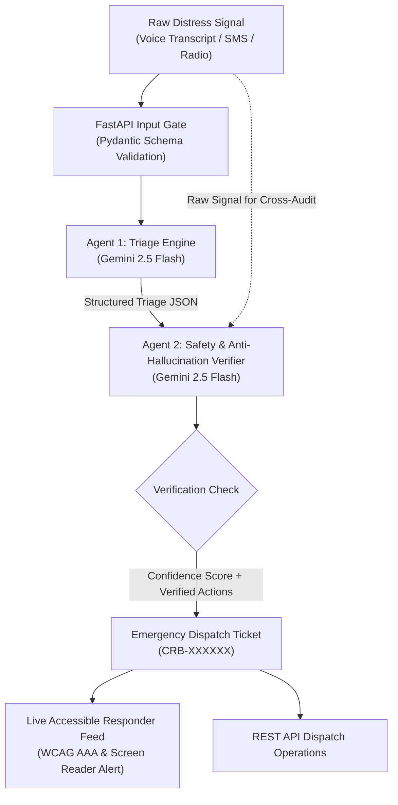

# 🛰️ CrisisBridge: AI-Powered Emergency Triage Hub

[](https://ai.google.dev/)
[](https://fastapi.tiangolo.com/)
[](https://tailwindcss.com/)
[](https://www.w3.org/WAI/standards-guidelines/wcag/)
[-243354?logo=googlecloud&logoColor=white)](https://cloud.google.com/run)

**CrisisBridge** is an emergency response hub designed for **Google PromptWars**. It solves the critical first 30-minute disaster communications breakdown by ingests noisy, panicked civilian distress inputs (chaotic text, voice transcripts, 911/112 calls, SMS) and transforming them into structured, verified, anti-hallucinated rescue tickets ready for dispatchers and field rescue teams.

---

## 🧭 Problem Statement & Alignment

During flash floods, building collapses, wildfires, or mass casualty events:
- **Civilian messages are panicked and unstructured**: e.g., *"Water touching electrical box! 4 elders and 2 infants stuck on terrace at 4th Cross near Bellandur lake, send boat now!!"*
- **Single-stage AI models hallucinate**: LLMs without checks can invent addresses, hallucinate casualties, or downplay critical threats to life.
- **Dispatchers face cognitive overload**: Sorting hundreds of conflicting calls causes deadly response delays.

### The CrisisBridge Solution:
1. **Unstructured to Structured Pipeline**: Extracts exact locations, landmarks, hazard indicators, and specific tactical resources (Boats, ALS Ambulances, Hydraulic Cutters).
2. **Autonomous Two-Stage Verification**: Agent 1 triages; Agent 2 independently audits Agent 1's findings against the raw text to verify ground truth and assign a 0–100% confidence rating.
3. **Prioritized Action Queue**: Sorts incidents by real-time life threat level (CRITICAL ➔ HIGH ➔ MEDIUM ➔ LOW) with full dispatch lifecycle tracking (`PENDING` ➔ `DISPATCHED` ➔ `RESOLVED`).

---

## 🏗️ Architecture & Two-Stage Gemini Engine



### Two-Stage Google Agent Engine (`services/gemini_service.py`):
- **Stage 1 (Triage Engine)**:
  - Model: `gemini-2.5-flash` with structured Pydantic schema `TriageResult`.
  - Extracts incident type (`Flood`, `Fire`, `Medical`, `Structural`, `Hazardous`, `Other`), urgency level (`CRITICAL`, `HIGH`, `MEDIUM`, `LOW`), estimated victims trapped count, location/landmarks, and required tactical resources list.
- **Stage 2 (Safety & Verification Verifier)**:
  - Model: `gemini-2.5-flash` with structured Pydantic schema `VerificationResult`.
  - Double-checks Agent 1's output against hallucination, verifies factual grounding against the raw message, flags discrepancies, and calculates an objective confidence score (0-100%).
- **Resilient Zero-Downtime Fallback**:
  - If `GEMINI_API_KEY` is not present in the local environment, the engine gracefully transitions to an intelligent rule-based heuristic extractor so automated tests, evaluators, and offline demonstrations never crash.

---

## ♿ Accessible Responder Dashboard (`static/index.html`)

- **WCAG AAA Compliance**:
  - Semantic HTML5 landmarks: `<header>`, `<main id="main-content">`, `<section>`, `<article>`, `<nav>`, `<form>`.
  - Accessible Skip Navigation Link (`Skip to primary content`).
  - High-contrast color palette: Deep navy surface (`#0d1527`), crisp slate text (`#e2e8f0`), high-visibility red (`#ef4444`) and amber (`#f59e0b`) alert tokens.
  - Distinct focus rings with `focus-visible:ring-4 focus-visible:ring-sky-400 focus-visible:outline-none`.
  - ARIA live announcements (`role="status" aria-live="polite"`) for incoming critical tickets.
  - Synthesized Web Audio API emergency sound alerts with zero external audio file dependencies.
- **Left Column: Victim Signal Simulator**:
  - Text area with character counter and keyboard shortcut (`Ctrl + Enter` / `Cmd + Enter`).
  - Signal source selector (Voice Transcript, SMS, Emergency Radio, Web SOS).
  - One-click disaster simulation presets:
    - *🌊 Bangalore Flood Rescue* (Submerged terrace, 6 trapped near Bellandur Lake)
    - *🔥 Peenya Factory Fire* (Toxic black smoke, locked shutters, 3 guards trapped)
    - *🏚️ ORR Building Collapse* (Scaffolding collapse, 5 workers pinned)
    - *🚑 Cardiac Trauma SOS* (Elderly stroke patient in flooded unreachable zone)
- **Right Column: Live Responder Feed**:
  - Real-time incident cards sorted by urgency.
  - Visual confidence gauge and Agent 2 audit reasoning.
  - Interactive status transitions: `Dispatch Rescue` ➔ `Mark Resolved`.
  - Search filter by keyword and urgency level dropdown.

---

## 🔒 Security Architecture

- **Strict Environment Separation**: `GEMINI_API_KEY` is read strictly from `os.environ` (or `.env` via `python-dotenv`). Never hardcoded or logged in outputs.
- **Strict Pydantic Validation**: All endpoints enforce schema validation, minimum character lengths, whitespace rejection, and bounded field ranges.
- **CORS Middleware**: Preconfigured for multi-agency emergency operations.
- **Non-Root Docker Container**: Cloud Run container runs under unprivileged UID `1000` (`appuser`).

---

## 🚀 Quickstart & Local Setup

### 1. Clone & Setup Virtual Environment
```bash
git clone <repository-url> disaster-bridge
cd disaster-bridge

python -m venv venv
# On Windows PowerShell:
.\venv\Scripts\Activate.ps1
# On Linux / macOS:
source venv/bin/activate
```

### 2. Install Dependencies
```bash
pip install -r requirements.txt
```

### 3. Configure API Key
Copy the template and provide your Google Gemini API key:
```bash
cp .env.example .env
```
Edit `.env`:
```env
GEMINI_API_KEY=your_google_gemini_api_key_here
PORT=8080
```
*(Note: If no API key is provided, CrisisBridge operates in resilient heuristic demonstration mode).*

### 4. Run the Application
```bash
uvicorn main:app --host 0.0.0.0 --port 8080 --reload
```
Open your browser at: **`http://localhost:8080`**

---

## 🧪 Comprehensive Test Suite

The test suite thoroughly verifies health checks, edge cases, input validation, two-stage mocked Gemini pipelines, and fallback heuristics:

```bash
pytest tests/test_app.py -v
```

### Tested Capabilities:
- ✅ Health monitoring endpoint (`GET /health` and `GET /api/health`).
- ✅ Semantic landing page delivery (`GET /`).
- ✅ Rejection of empty, whitespace-only, too-short, and oversized payloads.
- ✅ End-to-end signal triage with structured output verification.
- ✅ Mocked `google-genai` two-stage pipeline execution verifying Agent 1 and Agent 2 coordination.
- ✅ Priority-based ticket sorting (CRITICAL first).
- ✅ Multi-attribute search and urgency filters.
- ✅ Ticket status progression (`PENDING` ➔ `DISPATCHED` ➔ `RESOLVED`).
- ✅ Aggregated statistics computation.
- ✅ Fallback heuristic accuracy across Flood, Fire, Medical, and Structural emergencies.

---

## 🐳 Google Cloud Run Deployment

The included `Dockerfile` is optimized for Google Cloud Run:
- Exposes port `8080`
- Configured with `PORT` environment variable support
- Runs unprivileged `appuser`

### Local Docker Build & Run:
```bash
docker build -t crisisbridge:latest .
docker run -p 8080:8080 -e GEMINI_API_KEY="your_api_key" crisisbridge:latest
```

### Deploy Directly to Google Cloud Run:
```bash
gcloud run deploy crisisbridge \
  --source . \
  --platform managed \
  --region us-central1 \
  --allow-unauthenticated \
  --set-env-vars GEMINI_API_KEY="your_gemini_api_key"
```

---

## 📑 API Reference

| Method | Endpoint | Description |
|---|---|---|
| `GET` | `/` | Accessible Emergency Responder Dashboard |
| `GET` | `/health` | Service health & Gemini AI status monitor |
| `POST` | `/api/triage` | Ingests raw signal and runs Two-Stage AI pipeline |
| `GET` | `/api/tickets` | Lists tickets sorted by urgency with search & filters |
| `GET` | `/api/tickets/{id}` | Retrieves full ticket details by ID |
| `PATCH` | `/api/tickets/{id}/status` | Updates ticket dispatch status |
| `GET` | `/api/stats` | Aggregated command center statistics |

---

## 🏆 Google PromptWars Evaluation Matrix Alignment

| Rubric Criterion | Implementation in CrisisBridge |
|---|---|
| **Problem Statement Alignment** | Directly tackles disaster communications breakdown; transforms chaotic panicked distress text into structured, prioritized rescue tickets. |
| **Two-Stage Google Agent Engine** | Uses `gemini-2.5-flash` with the official `google-genai` SDK: Agent 1 triages; Agent 2 audits against hallucinations and scores confidence (0-100%). |
| **Code Quality & Architecture** | Modular separation of concerns (`main.py`, `services/gemini_service.py`, `tests/`), typed enums, and structured models. |
| **Security** | Strict `os.environ` secrets retrieval, strict Pydantic validation on all inputs, CORS configuration, and non-root Docker user. |
| **Efficiency** | Fast async FastAPI endpoints, structured JSON responses, and instant client-side Web Audio alerts. |
| **Testing** | Comprehensive `pytest` suite with mocked Gemini clients and edge case coverage. |
| **Accessibility (A11y)** | WCAG AAA compliant dark mode, semantic HTML5, ARIA roles/live regions, skip links, and full keyboard navigation. |
